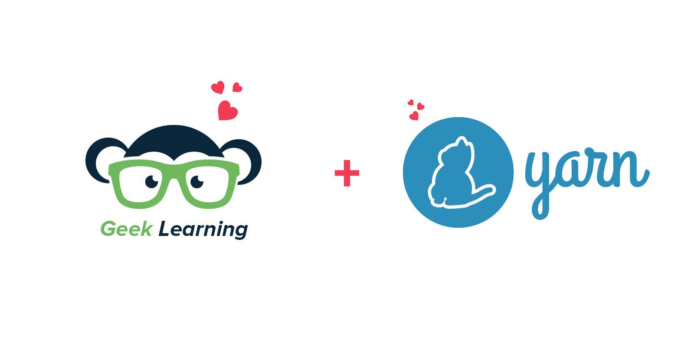
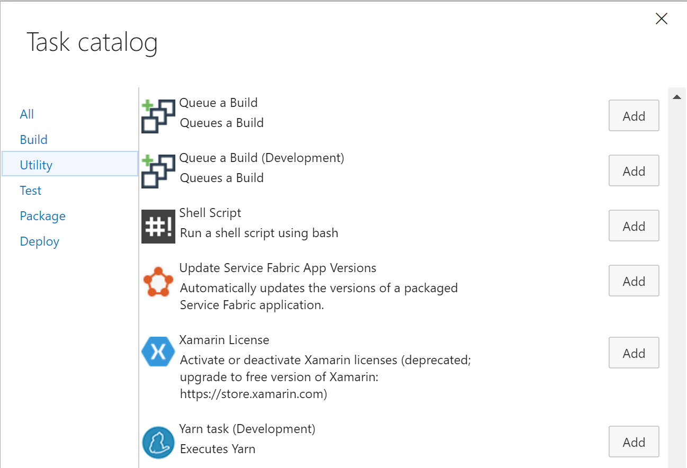
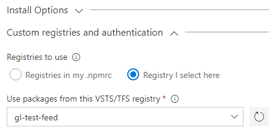

# Yarn Build and Release Tasks

[Yarn](https://yarnpkg.com/) is Facebook's npm alternative. It is the fast, reliable and secure dependency management. 
This extension brings the power of Yarn to Visual Studio Team Services Build and Release Management. It enables use to use yarn with against official npm registry or any registry you like such as Myget or [Visual Studio Team Services Package Management](https://marketplace.visualstudio.com/items?itemName=ms.feed#).

Why so much sudden love for Yarn ? You can find out [here](http://geeklearning.io/npm-install-drives-you-crazy-yarn-and-chill) 

[Learn more](https://github.com/geeklearningio/gl-vsts-tasks-yarn/wiki) about this extension on the wiki!

## Tasks included

* **[Yarn](https://github.com/geeklearningio/gl-vsts-tasks-yarn/wiki/Yarn)**: Execute Yarn (Yarn is bundled for Hosted Agents)

## Steps

After installing the extension, you can add one (or more) of the tasks to a new or existing [build definition](https://www.visualstudio.com/en-us/docs/build/define/create) or [release definition](https://www.visualstudio.com/en-us/docs/release/author-release-definition/more-release-definition)

Starting with version `1.x`, you can configure custom registries directly in the task settings:

## Learn more

The [source](https://github.com/geeklearningio/gl-vsts-tasks-yarn) for this extension is on GitHub. Take, fork, and extend.

## Release Notes

Please refer to our [release page on Github](https://github.com/geeklearningio/gl-vsts-tasks-yarn/releases)