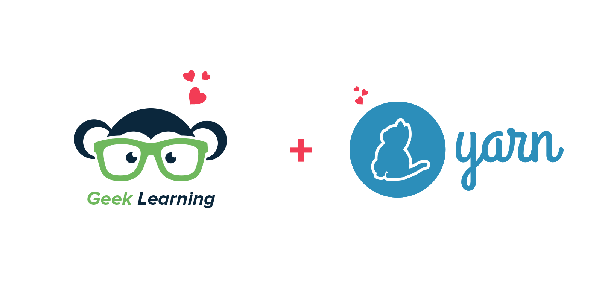
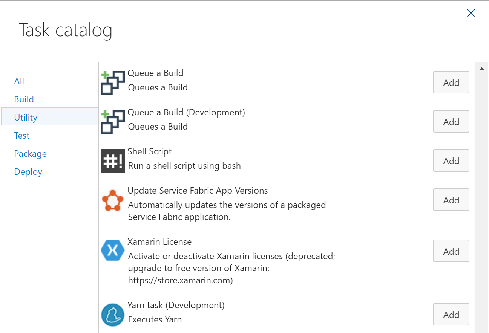
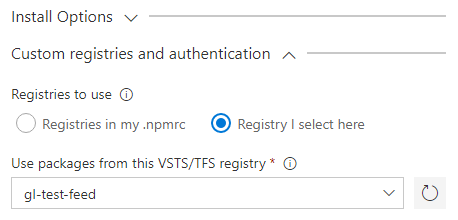

# Yarn Build and Release Tasks

> ## ⚠️ Deprecated and unmaintained
>
> This extension is **no longer maintained**. No further releases, bug fixes or security
> updates will be published, and [Yarn 1.x (Classic)](https://classic.yarnpkg.com/) is itself
> end-of-life.
>
> **You almost certainly don't need it** — see *Migrating off this extension* below.
> The repository is left as-is for anyone who still depends on it. Feel free to fork.

## Migrating off this extension

Yarn 1.x is already available in the standard hosted agent images, and Yarn 2 and later can be
enabled directly through [Corepack](https://nodejs.org/api/corepack.html). Between the two,
none of this needs an extension any more.

The following does everything this extension did, with nothing installed:

```yaml
variables:
  YARN_CACHE_FOLDER: $(Pipeline.Workspace)/.yarn-cache

steps:
  - task: NodeTool@0
    inputs:
      versionSpec: "20.x"

  - task: Bash@3
    displayName: Yarn enable
    inputs:
      targetType: "inline"
      script: |
        corepack enable
        corepack prepare yarn@stable --activate

  - task: Cache@2
    displayName: Cache Yarn packages
    inputs:
      key: '"yarn" | "$(Agent.OS)" | yarn.lock'
      restoreKeys: |
        yarn | "$(Agent.OS)"
        yarn
      path: $(YARN_CACHE_FOLDER)

  - task: Bash@3
    displayName: Yarn
    inputs:
      targetType: "inline"
      script: |
        yarn --immutable

  - task: Bash@3
    displayName: Yarn build
    inputs:
      targetType: "inline"
      script: |
        yarn build
```

If your project pins its Yarn version with the `packageManager` field in `package.json`, then
`corepack enable` on its own is enough and the `corepack prepare` line can be dropped. On Yarn
1.x, use `yarn --frozen-lockfile` in place of `yarn --immutable`.

If package feed authentication is needed — the one thing the **Yarn** task did beyond running
Yarn — the built-in
[npm authenticate](https://learn.microsoft.com/azure/devops/pipelines/tasks/reference/npm-authenticate-v0)
task does the job.

[Yarn](https://yarnpkg.com/) is Facebook's npm alternative. It is the fast, reliable and secure dependency management. 
This extension brings the power of Yarn to Visual Studio Team Services Build and Release Management. It enables using yarn with the official npm registry or any registry you like such as Myget or [Visual Studio Team Services Package Management](https://marketplace.visualstudio.com/items?itemName=ms.feed#).



Why so much sudden love for Yarn ? You can find out [here](http://geeklearning.io/npm-install-drives-you-crazy-yarn-and-chill) 

[Learn more](https://github.com/geeklearningio/gl-vsts-tasks-yarn/wiki) about this extension on the wiki!

## Tasks included

* **[Yarn installer](https://github.com/geeklearningio/gl-vsts-tasks-yarn/wiki/Yarn-Installer)**: Installs Yarn 
* **[Yarn](https://github.com/geeklearningio/gl-vsts-tasks-yarn/wiki/Yarn)**: Execute Yarn

> Note that Yarn installer uses new agents features hence TFS 2015 is not supported.

## Steps

After installing the extension, you can add one (or more) of the tasks to a new or existing [build definition](https://www.visualstudio.com/en-us/docs/build/define/create) or [release definition](https://www.visualstudio.com/en-us/docs/release/author-release-definition/more-release-definition)



Starting with version `1.x`, you can configure custom registries directly in the task settings:



## Learn more

The [source](https://github.com/geeklearningio/gl-vsts-tasks-yarn) for this extension is on GitHub. Take, fork, and extend.

## Known Issues

Please refer to our [wiki page on Github](https://github.com/geeklearningio/gl-vsts-tasks-yarn/wiki/Known-Issues)

## Release Notes

Please refer to our [release page on Github](https://github.com/geeklearningio/gl-vsts-tasks-yarn/releases)
